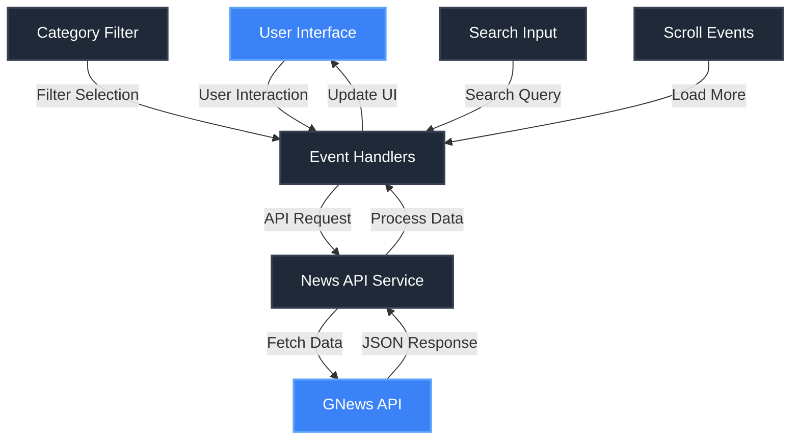
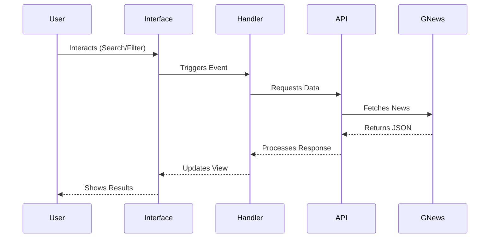

# 🌐 Global News Portal

[](https://krajtilak-news-portal.vercel.app/)


[](https://developer.mozilla.org/en-US/docs/Web/JavaScript)
[](https://developer.mozilla.org/en-US/docs/Web/HTML)
[](https://developer.mozilla.org/en-US/docs/Web/CSS)

> 📰 A modern, responsive news aggregator powered by GNews API with a sleek dark theme interface.

## ✨ Features

- 🔍 Real-time news search
- 🗂️ Category-based filtering
- 🌙 Elegant dark theme
- 📱 Fully responsive design
- ⚡ Fast loading with skeleton placeholders
- 🔄 Auto-refresh functionality
- 📜 Infinite scroll support
- ⌚ Real-time updates

## 🏗️ Architecture



## 🚀 Quick Start

1. Clone the repository:
```bash
git clone https://github.com/yourusername/global-news-portal.git
```

2. Install dependencies:
```bash
npm install
```

3. Create a `.env` file and add your GNews API key:
```env
GNEWS_API_KEY=your_api_key_here
```

4. Start the development server:
```bash
npm run dev
```

## 🛠️ Tech Stack

- 🌐 **Frontend**: HTML5, CSS3, JavaScript
- 🔌 **API**: GNews API
- 🎨 **Design**: Custom CSS with Dark Theme
- 🔧 **Tools**: Vite, ESLint

## 📦 Project Structure

```
global-news-portal/
├── js/
│   ├── api.js        # API handling
│   ├── app.js        # Main application logic
│   ├── config.js     # Configuration
│   ├── ui.js         # UI components
│   └── utils.js      # Utility functions
├── styles.css        # Global styles
├── index.html        # Entry point
└── README.md         # Documentation
```

## 🔄 Data Flow



## 🎯 Core Features Explained

### News Fetching
- Real-time news updates using GNews API
- Efficient data caching
- Error handling with retry mechanism

### Search & Filtering
- Debounced search implementation
- Category-based filtering
- Dynamic query building

### UI/UX
- Responsive grid layout
- Skeleton loading states
- Smooth animations
- Infinite scroll

## 📱 Responsive Design

The application is fully responsive and works seamlessly across:
- 💻 Desktop (1200px+)
- 💻 Laptop (1024px)
- 📱 Tablet (768px)
- 📱 Mobile (480px)

## 🤝 Contributing

1. Fork the repository
2. Create your feature branch (`git checkout -b feature/AmazingFeature`)
3. Commit your changes (`git commit -m 'Add some AmazingFeature'`)
4. Push to the branch (`git push origin feature/AmazingFeature`)
5. Open a Pull Request

## 📄 License

This project is licensed under the MIT License - see the [LICENSE](LICENSE) file for details.

## 👏 Acknowledgments

- [GNews API](https://gnews.io/) for providing the news data
- [Lucide Icons](https://lucide.dev/) for the beautiful icons
- [Inter Font](https://fonts.google.com/specimen/Inter) for typography

---

<p align="center">Made with ❤️ by K Rajtilak</p>
